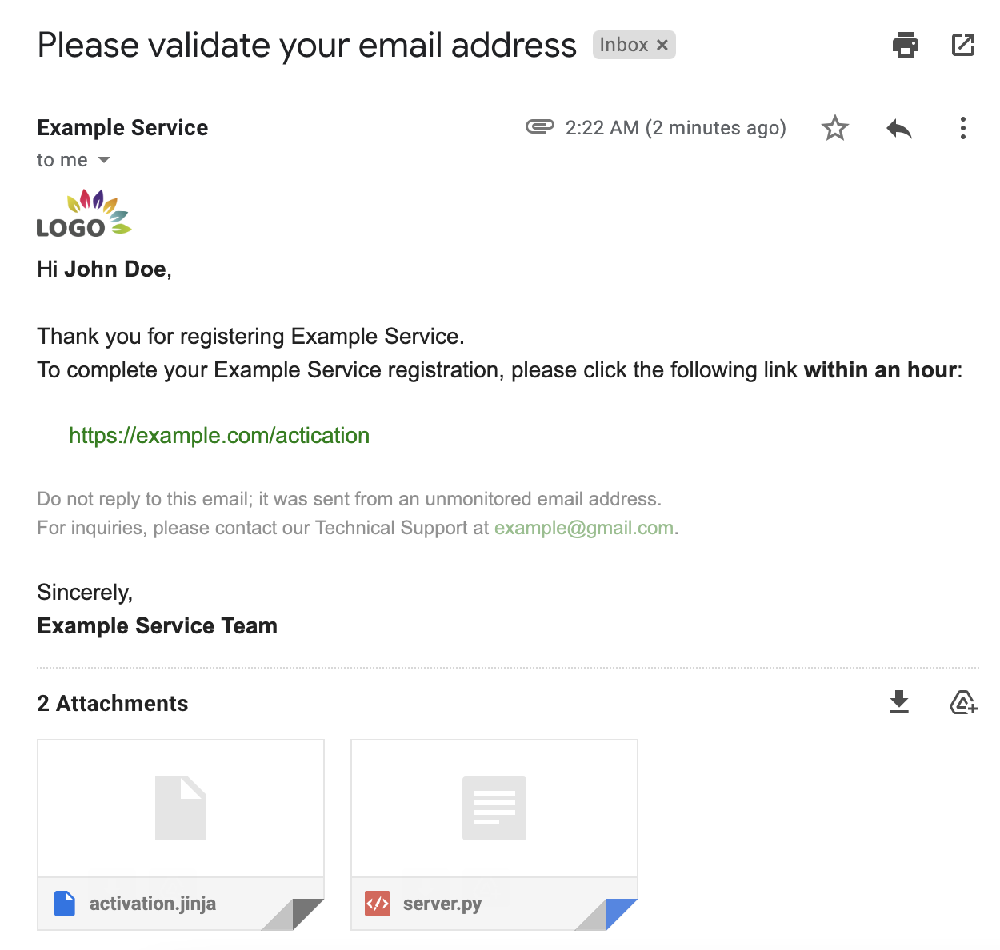

<pre><p align="center"><code>
╔═╗╔═╗┌─┐┬─┐┬  ┬┌─┐┬─┐
║ ╦╚═╗├┤ ├┬┘└┐┌┘├┤ ├┬┘
╚═╝╚═╝└─┘┴└─ └┘ └─┘┴└─
</code></p></pre>

<p align="center">


</p>

---

Simple self-hostable, centralized, development mail server that <strong style="color:green">DOESN'T REQUIRE</strong> a cloud mail service acccount, <strong style="color:green">DOESN'T REQUIRE</strong> docker compose configurations and <strong style="color:green">DOESN'T REQUIRE</strong> a HTTPS certificate.

> **Notice: DO NOT** use this project in production environments.



## Features

- 🔥 <strong style="color:green">RESTful API</strong>, basic url request in any coding language;
- 🥹 <strong style="color:green">Authentic</strong>, send actual email;
- ✨ <strong style="color:green">Lightweight yet Reliable</strong>, use Gmail under the hood;
- 🚀 <strong style="color:green">OOTB</strong>, working out-of-the-box with almost zero config;
- 🐳 <strong style="color:green">Docker Ready</strong>, start your service in less than 1 minute;
- ⚛️ <strong style="color:green">Heroku Ready</strong>, deploy your service in less than 1 minute.

## Prerequisites

- [Google App Password](https://support.google.com/accounts/answer/185833?hl=en#app-passwords)
- Nothing else 😊

## Get Started

```bash
read -p "GMAIL_APP_PASSWORD: " -s password && \
docker run --rm -it -p <LOCAL_PORT>:8080 \
    -e "GMAIL_USERNAME=<YOUR_USERNAME>@gmail.com" \
    -e "SENDER_NAME=<YOUR_NAME>" \
    -e "GMAIL_APP_PASSWORD=${password}" \
    gmail_server:latest
```

> There will be a prompt for "GMAIL_APP_PASSWORD", paste your Gmail App password and press enter (whatever you paste or input will not shown on the screen).

## Usage Example

Here's a simple example for Python users:

```python
import requests

resp = requests.get(SERVER_INSTANCE, params={
    'subject': 'Please validate your email address',
    'receiver': [RECEIVER_EMAIL, ANOTHER_RECEIVER_EMAIL],
    'html': f'<h1>Hello from {BRAND_NAME}!</h1>',
})
resp.raise_for_status()
print(resp.json())
```

## Templates

The GServer also supports templates. GServer ships with a [default template](https://github.com/john-theo/GmailServer/blob/main/templates/activation.jinja) (for new registered account activation), to use this template:

```python
activation_template_args = {
    'username': 'John Theo',
    'activation_link': 'https://github.com/john-theo',
    'brand_name': BRAND_NAME,
    'contact_email': RECEIVER_EMAIL,
}
resp = requests.post(SERVER_INSTANCE, data={
    'subject': 'Please validate your email address',
    'receiver': [RECEIVER_EMAIL],
    'template': 'activation',
    **activation_template_args
}, files=[
    ('attachments', ('activation.jinja', open('templates/activation.jinja', 'rb'))),
    ('attachments', ('server.py', open('src/server.py', 'rb')))
])
resp.raise_for_status()
print(resp.json())
```

You can also mount your own templates into the docker container and use them.

### Debugging

To debug your own templates, you can use the `/debug` endpoint with the same request payload, it will response with parsed results in json format.

## Deploy

1. Clone this repository
2. Change `.env` content
3. Create a `.env.local` with `GMAIL_APP_PASSWORD=<YOUR_PASSWORD>`

then

```bash
make heroku_init
make heroku_push
```

## Future Work

Add basic authentication so that not everybody can use your gmail to send emails.

## License

<p xmlns:cc="http://creativecommons.org/ns#" xmlns:dct="http://purl.org/dc/terms/"><a property="dct:title" rel="cc:attributionURL" href="https://avatars.githubusercontent.com/u/36699957">Gmail Server</a> by <a rel="cc:attributionURL dct:creator" property="cc:attributionName" href="https://github.com/john-theo">John Dope</a> is licensed under <a href="http://creativecommons.org/licenses/by-nc-sa/4.0/?ref=chooser-v1" target="_blank" rel="license noopener noreferrer" style="display:inline-block;">Attribution-NonCommercial-ShareAlike 4.0 International</a></p>